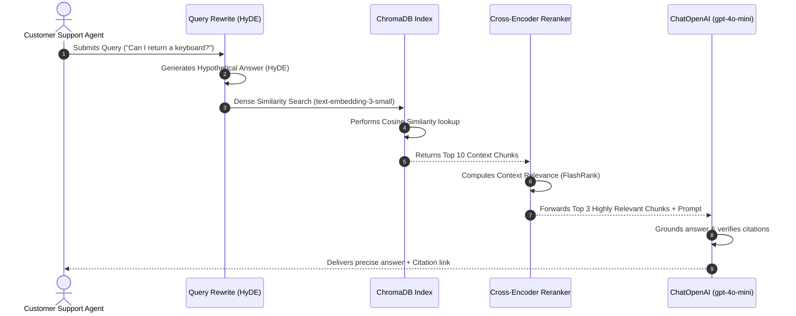

# 📘 Enterprise-Grade Policy Q&A Assistant: Full-Phase RAG System Documentation

This document serves as an exhaustive, visually-enriched engineering reference for the **RAG-APP-IIT** system. It details the system architecture, mathematical foundations of similarity retrieval, advanced indexing strategies, hybrid retrieval systems, and includes curated, elite learning resources.

---

## 📝 Introduction & Scope

### Project Purpose
The **RAG-APP-IIT** project is a lightweight, high-performance customer support virtual assistant designed to answer queries based strictly on internal corporate store policies. It implements a **Retrieval-Augmented Generation (RAG)** pipeline to query private markdown files and return citations.

### Documentation Coverage
This documentation provides a full-phase design review of the system, covering:
1. **System Workflows**: End-to-end visuals of the ingestion database build and runtime generation.
2. **Directory Anatomy**: Detailed roles of the script assets and manifest requirements.
3. **Core RAG Mathematics**: Concrete explanations and math formulas of embedding metrics.
4. **Production Architectures**: Advanced modules (Hybrid Search, Reciprocal Rank Fusion, Cross-Encoder rerankers, HyDE).
5. **Tutorial Reference Links**: Handpicked websites and videos for additional training.

---

## 🗂️ Table of Contents (Index)
*   [📝 Introduction & Scope](#-introduction--scope)
*   [🗺️ 1. Complete End-to-End System Visualization](#️-1-complete-end-to-end-system-visualization)
    *   [🛠️ Ingestion Pipeline (Offline Phase)](#️-ingestion-pipeline-offline-phase)
    *   [⚡ Retrieval & Generation Loop (Online Phase)](#-retrieval--generation-loop-online-phase)
*   [📂 2. File & Component Architecture](#-2-file--component-architecture)
*   [🎛️ 3. Deep-Dive Conceptual Analysis](#️-3-deep-dive-conceptual-analysis)
    *   [✂️ Chunking Strategies Comparison](#️-chunking-strategies-comparison)
    *   [📐 Vector Space and Similarity Metrics](#-vector-space-and-similarity-metrics)
    *   [🗄️ Vector Database Landscape](#️-vector-database-landscape)
*   [⚡ 4. Advanced Production RAG Enhancements](#️-4-advanced-production-rag-enhancements)
    *   [A. Hybrid Search & Reciprocal Rank Fusion (RRF)](#a-hybrid-search--reciprocal-rank-fusion-rrf)
    *   [B. Bi-Encoder vs. Cross-Encoder Rerankers](#b-bi-encoder-vs-cross-encoder-rerankers)
    *   [C. Query Rewriting (HyDE)](#c-query-rewriting-hyde)
*   [🖥️ 5. Simulated User Interface Execution](#️-5-simulated-user-interface-execution)
*   [📚 6. Essential Learning Resources](#-6-essential-learning-resources)

---


## 🗺️ 1. Complete End-to-End System Visualization

### 🛠️ Ingestion Pipeline (Offline Phase)
The offline ingestion pipeline processes raw files, splits them semantically, converts them to mathematical vectors, and stores them in a high-performance vector index.

```
+------------------+     +-------------------+     +-------------------------+
|                  |     |                   |     |                         |
|  policies/ (.md) | --> |  DirectoryLoader  | --> | MarkdownHeaderSplitter  |
|  Source Files    |     |   (Load Content)  |     |   (Semantic Boundaries) |
|                  |     |                   |     |                         |
+------------------+     +-------------------+     +-------------------------+
                                                                |
                                                                v
+------------------+     +-------------------+     +-------------------------+
|                  |     |                   |     |                         |
|    ChromaDB      | <-- | OpenAI Embeddings | <-- |  Recursive Character    |
| (Vector Storage) |     | (text-embedding-3)|     |   Splitter (Sliding)    |
|                  |     |                   |     |                         |
+------------------+     +-------------------+     +-------------------------+
```

### ⚡ Retrieval & Generation Loop (Online Phase)
The online phase intercepts user queries, expands/rewrites them, performs hybrid vector & keyword retrieval, filters with a reranking model, and synthesizes answers using an LLM.



---

## 📂 2. File & Component Architecture

Below is the directory mapping for [Coding Files & Projects/RAG-APP-IIT](file:///c:/Users/ayush/OneDrive/Desktop/AI%20ML%20IIT%20Mandi/01_Daily_Lectures_IIT_Mandi/03_Special_Classes/Industry%20Session%205/Coding%20Files%20&%20Projects/RAG-APP-IIT):

| File Path | Purpose | Key Parameters / Inputs |
| :--- | :--- | :--- |
| **[requirements.txt](file:///c:/Users/ayush/OneDrive/Desktop/AI%20ML%20IIT%20Mandi/01_Daily_Lectures_IIT_Mandi/03_Special_Classes/Industry%20Session%205/Coding%20Files%20&%20Projects/RAG-APP-IIT/requirements.txt)** | Package dependency manifest. | Contains core `langchain`, `langchain-chroma`, and `langchain-openai`. |
| **[create_sample_corpus.py](file:///c:/Users/ayush/OneDrive/Desktop/AI%20ML%20IIT%20Mandi/01_Daily_Lectures_IIT_Mandi/03_Special_Classes/Industry%20Session%205/Coding%20Files%20&%20Projects/RAG-APP-IIT/create_sample_corpus.py)** | Generates markdown knowledge base. | Dict containing policies for `return`, `refund`, `shipping`, `warranty`, and `cancellation`. |
| **[ingest.py](file:///c:/Users/ayush/OneDrive/Desktop/AI%20ML%20IIT%20Mandi/01_Daily_Lectures_IIT_Mandi/03_Special_Classes/Industry%20Session%205/Coding%20Files%20&%20Projects/RAG-APP-IIT/ingest.py)** | Main ingestion orchestrator. | Loads from `policies/` and persists to `chroma_db/`. |
| **[RAG_APP_IIT_Documentation.md](file:///c:/Users/ayush/OneDrive/Desktop/AI%20ML%20IIT%20Mandi/01_Daily_Lectures_IIT_Mandi/03_Special_Classes/Industry%20Session%205/Coding%20Files%20&%20Projects/RAG-APP-IIT/RAG_APP_IIT_Documentation.md)** | Technical reference manual (This file). | Rich diagrams, formulas, tables, and guides. |

---

## 🎛️ 3. Deep-Dive Conceptual Analysis

### ✂️ Chunking Strategies Comparison
Choosing the correct splitting method directly determines retrieval success.

| Strategy | Mechanism | Pros | Cons | Best Use Case |
| :--- | :--- | :--- | :--- | :--- |
| **Fixed-Size Chunking** | Splits text at fixed character intervals (e.g., 500 chars). | Simple, fast execution. | Splits sentences in half, causing context loss. | Quick prototypes. |
| **Recursive Character** | Splitting hierarchy: `\n\n` $\rightarrow$ `\n` $\rightarrow$ ` ` $\rightarrow$ `""`. | Keeps paragraphs and sentences intact. | Boundaries can still cut context groups. | General text, blogs, manuals. |
| **Markdown Header** | Splits according to Markdown headers (`#`, `##`, `###`). | High semantic coherence; preserves structure. | Fails if Markdown is formatted incorrectly. | Corporate policies, READMEs. |
| **Semantic Chunking** | Splits when distance between sentence embeddings exceeds threshold. | Captures exact semantic shifts. | High API latency; computationally expensive. | Legal contracts, complex essays. |

---

### 📐 Vector Space and Similarity Metrics
Vector embeddings place text chunks in an $N$-dimensional space. The distance between these vectors correlates with semantic similarity.

```
                Vector Space (Similarity Visualization)
                
                     ^  (Dimension Y)
                     |       
                     |       [Refund Chunks]
                     |         o   o o
                     |          o o
                     |                     [Shipping Chunks]
                     |                        o   o  o
                     |                         o o o
                     |
                     |       [Query: "How to return?"]
                     |          \
                     |           \  theta (Angle)
                     |            \
                     |             o [Return Chunks]
                     |            o o
                     +------------------------------------> (Dimension X)
```

#### Mathematical Formulations

##### 1. Cosine Similarity
Measures the cosine of the angle $\theta$ between two vectors. It ranges from $-1$ to $1$, focusing on direction rather than magnitude.
$$\text{Similarity}(\vec{A}, \vec{B}) = \cos(\theta) = \frac{\vec{A} \cdot \vec{B}}{\|\vec{A}\| \|\vec{B}\|} = \frac{\sum_{i=1}^n A_i B_i}{\sqrt{\sum_{i=1}^n A_i^2} \sqrt{\sum_{i=1}^n B_i^2}}$$

##### 2. L2 Distance (Euclidean)
Measures the straight-line distance between two points in Euclidean space. Closer points have a lower distance score.
$$d(\vec{A}, \vec{B}) = \sqrt{\sum_{i=1}^n (A_i - B_i)^2}$$

##### 3. Dot Product (Inner Product)
If vectors are normalized (magnitude is 1), the dot product corresponds directly to Cosine Similarity.
$$\vec{A} \cdot \vec{B} = \sum_{i=1}^n A_i B_i$$

---

### 🗄️ Vector Database Landscape

| Database | Architecture | Persistent Indexing | Ideal Scale | Best For |
| :--- | :--- | :--- | :--- | :--- |
| **ChromaDB** | SQLite Embedded/Server | In-memory with file persistence. | Small to Medium (< 100k docs) | Embedded Python apps, local RAG. |
| **PGVector** | PostgreSQL Extension | Extends relational PostgreSQL database. | Medium to Large (< 5M docs) | Existing relational stack setups. |
| **Pinecone** | Cloud Native (SaaS) | Fully managed cloud indexing. | Large to Enterprise (> 10M docs) | Serverless production pipelines. |
| **Milvus** | Distributed Cluster | Highly scalable distributed indexing. | Huge (> 100M docs) | Enterprise clustering, big data pipelines. |

---

## ⚡ 4. Advanced Production RAG Enhancements

```
                         Advanced Ingestion & Retrieval Pipeline
                         
  +---------------+       +------------------+       +-------------------+
  |  User Query   | ----> |  Query Rewriter  | ----> |   HyDE Engine     |
  +---------------+       +------------------+       +-------------------+
                                                               |
                                                               v
  +---------------+       +------------------+       +-------------------+
  | LLM Synthesis | <---- |   Reranker       | <---- | Hybrid Search RRF |
  +---------------+       |  (Cross-Encoder) |       |  (Dense + Sparse) |
                          +------------------+       +-------------------+
```

### A. Hybrid Search & Reciprocal Rank Fusion (RRF)
To prevent keyword retrieval errors, we combine dense vectors (semantic) with sparse vectors (BM25 keyword search). 
*   **Reciprocal Rank Fusion (RRF)**: A scoring formula to merge results from two different retrievers. Chunks that rank high in both lists get pushed to the top:
$$RRF\_Score(d \in D) = \sum_{m \in M} \frac{1}{k + r_m(d)}$$
*(where $M$ represents the search models, $r_m(d)$ is the rank of document $d$ in search model $m$, and $k$ is a constant, typically $60$).*

### B. Bi-Encoder vs. Cross-Encoder Rerankers
*   **Bi-Encoder (Retrieval)**: Generates embeddings for queries and documents independently. Very fast, but ignores word interactions between query and context.
*   **Cross-Encoder (Reranking)**: Feeds query and document *together* into a transformer model, analyzing exact text relationships. Too slow for scanning millions of files, but ideal for re-ordering the top 10 results from the Bi-Encoder.

### C. Query Rewriting (HyDE)
*   **Hypothetical Document Embeddings (HyDE)**: Feeds the query to an LLM to generate a fake/hypothetical response. We convert this fake response into an embedding and use it to search the vector database. This matches text patterns more closely than searching with a question directly.

---

## 🖥️ 5. Simulated User Interface Execution

Here is a mock visual representing the command line execution when searching the database:

```
======================================================================
RAG POLICY ENGINE LOADED! Type 'exit' to quit.
======================================================================

Ask a question: Can I cancel my order for a customized coffee mug?
Searching database indices & synthesizing answer...

=== SYSTEM ANSWER ===
No, you cannot cancel your order. According to the Cancellation Policy,
orders containing personalized or made-to-order products cannot be 
cancelled once production starts [1].

=====================

[Source Citations]
[1] File: cancellation_policy.md | Header: # Cancellation Policy
```

---

## 📚 6. Essential Learning Resources

### Web Tutorials & Manuals
*   **[LangChain RAG Tutorial](https://python.langchain.com/docs/tutorials/rag/)**: Step-by-step introduction to retrieval pipelines.
*   **[Pinecone Vector Indexing Guide](https://www.pinecone.io/learn/vector-indexes/)**: In-depth tutorials explaining HNSW, IVF, and clustering algorithms.
*   **[LlamaIndex Retrieval Optimization](https://docs.llamaindex.ai/en/stable/optimizing/production_rag/)**: Production tips for chunking, metadata parsing, and reranking.

### YouTube Video Guides
*   **[RAG Whiteboard Architecture (IBM Technology)](https://www.youtube.com/watch?v=T-D1OfcDWUM)**: A 10-minute masterclass explaining retrieval augmented generation visually.
*   **[Vector Database Crash Course (freeCodeCamp)](https://www.youtube.com/watch?v=klTvEwg3o14)**: Building vector stores from scratch.
*   **[Advanced Retrieval Strategies (DeepLearning.AI)](https://www.youtube.com/watch?v=xM_C4e6U8m8)**: Concepts on HyDE, Sentence Window Retrieval, and Auto-Merging Retreivers.
